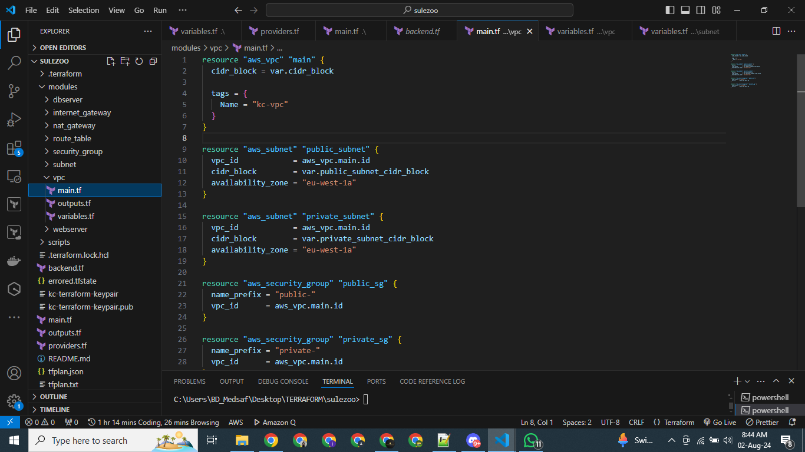

# terraform-vpc-project
A repository to store my terraform files for custom VPC creation. 

This is a continuation of my earlier project on VPCs which was created using clickops. Now, I am automating the entire infrastructure using Terraform.

## project set up
I am creating a custom VPC called KCVPC, with 2 subnets - private_subnet & public_subnet. Each subnet will house an Ubuntu Instance named ec2_private & ec2_public. Other parts of the infrastructure to be created include Internet Gateway (IGW), Route tables (public and private), NAT Gateway, Security groups and NACLs. Also, the backend is saved in a remote s3 bucket, and the state is locked in a dynamodb table. All these will be created using Infrastructure as Code tool called Terraform.

To make my terraform code modular, portable and reusable, I will create 8 modules which will be referenced in my main.tf file. These modules are: 
 - vpc
 - subnet
 - webserver
 - dbserver
 - internet_gateway
 - nat_gateway
 - route_table
 - security_group
 

Finally,  I included scripts to automatically install an nginx web server on the ec2_public instance and another script to deploy a postgresql server on the ec2_private instance. All the codes for this project are contained in this repository. 

This is the architectural diagram of the design I will be creating: 


## creating vpc
The first resource to be created is the vpc. After creating the vpc module, it will be referenced as module "vpc" in my main.tf file as shown in the diagram 




## creating subnets
A subnet module will be created which will be a template that I will use to create further subnets: 


Two subnets will be created, a publicSubnet and a privateSubnet in the main.tf file, referencing the child module subnet created above.


## creating internet gateway 
An internet gateway named kc-igw will be created as shown below. This will be used by the public subnet to connect to the internet.


## Creating route tables.
A route table child module will be created to serve as a template for my route tables. In the main.tf file, this will be referenced to create two separate routa tables - public_route_table and private_route_table. 


## Configuring NAT gateway
A nat Gateway will be configured in the public subnet. This will also include creating an elastic ip for the NAT gateway to use. 


## creating security groups 
Security groups are the Cloud firewalls that deny or allow traffic to specific ports based on set configurations. Two security groups will be created - privateSG and publicSG for both the private and public subnets. 


## Creating network access control lists
Network acls are an additional layer of security over the VPC to further deny or allow traffic. We will be creating nacl for both the public and private subnets 


## creating ec2 instances 
Two instances will be created named webserver and dbserver. The webserver instance will be created in the public subnet while the dbserver will be in the private subnet


## creating key pair
An ssh key pair will be created to enable us access the ec2 instances 


## creating backend 
A remote backend will be created to store the tfstate file in an s3 bucket, and locked in a dynamodb table. The configuration is shown in the screenshot below: 


## Deploying the setup 
To deploy the setup, run this command 
```bash
$ terraform init                     # to initialize the terraform configuration, download the modules and state files
$ terraform validate                 # to validate if the configuration is syntactically correct
$ terraform fmt                     # to format the configuration files to meet best practices
$ terraform plan -out tfplan.txt    # to create a plan of the infrastructure and save it as a file named tfplan.txt
$ terraform apply                    # to create the infrastructure

#Its best practice to destroy the infrastructure when you're done, so as not to accumulate cloud costs. Run this command to destroy all the infrastructure:
$ terraform destroy
```

Here are screenshots of the results of the terraform code 

### terraform init


### terraform validate 


### terraform plan 


### terraform apply 


### vpc successfully created 


### subnets successfully created 


### Security groups successfully created


### route tables successfully created 


### Network access control lists successfully created 


### Internet gateway successfully created 


### Elastic IP successfully created 


### keypair successfully created 


### ec2 instances successfully created 


 
### terraform destroy 


### end 
